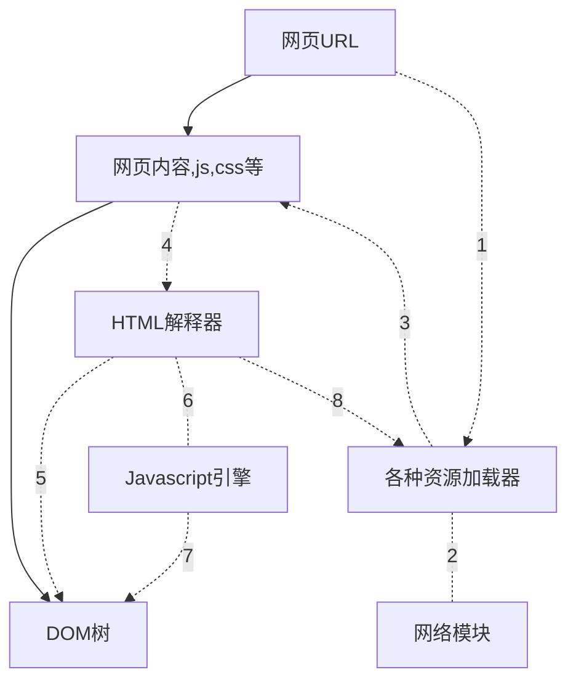
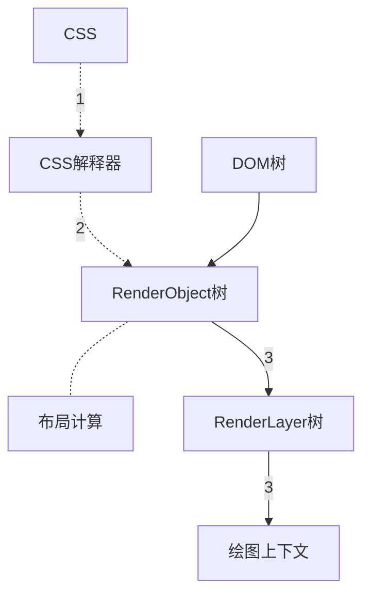
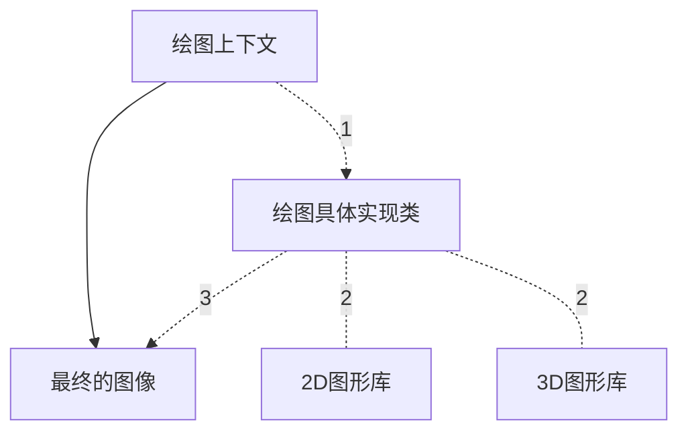

# 第二章 HTML网页和结构

## 基本元素与树形结构

WebKit中，这个文档会被构建成DOM树。

## WebKit的网页渲染过程

浏览器的主要作用是将用户输入的“URL”转变为可视化的图像。主要分为两个过程：用URL请求资源，将资源构建成DOM树；从DOM树生成可视化图像。

从网页URL到DOM树的流程：

上述过程中，网页在加载和渲染过程中会发出“DOMContent”事件和DOM的“onload”事件，分别在DOM树构建完成后，以及DOM构建完成并且网页依赖的资源都加载完成。

WebKit利用CSS和DOM树构建RenderObject树直到绘图上下文：

绘图上下文到最终生成图像：

问题：

chrome的performance的使用